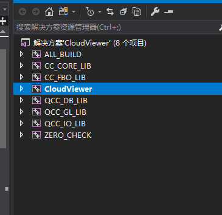
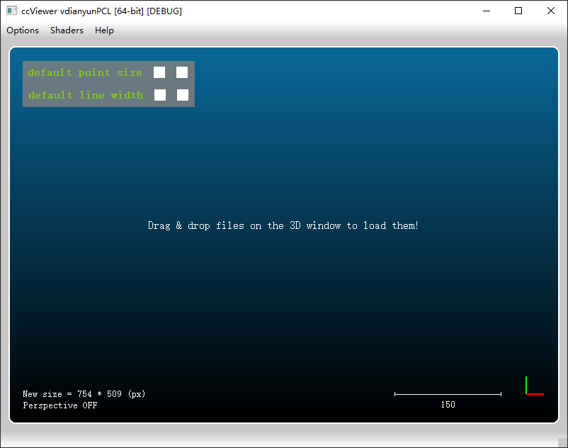

# Here record the process of building a project
---
# Compilation of project in Windows
--- 
## 1.Base dependencise
This project requires CMake to be built.
Before compilation, you need to install CMake in your system.

- On Windows it is recommended to use the installer from the [QT website](!https://www.qt.io/download-qt-installer).
- On Linux you can use your package manager to install CMake.

## 2. Cloning the repository
Clone the repository with the following command:
```bash
git clone git@github.com:Yangzhouzhou/myCloudCompareViewer.git
```
## 3. Building the project
### 3.1. Building with CMake on Windows
- Open CMake GUI.
- Set the source code path to the path of the cloned repository.
- Set the build path to the path where you want to build the project.
- Click on "Configure" and select your compiler.
  - If you want to use Visual Studio, select the version you want to use (e.g. Visual Studio 16 2019).
  - Make sure your compiler is set to x64.
  - Make sure you have pcl installed.
- Click on "Generate".
- Open the project in your build path with your compiler.


### 3.2 Compile the project
- Set 'CloudViewer' as the startup project.
- Compile the project.
- Run the project.
    - If you get an error about missing dlls, copy the dlls from the build folder.
    (such as: "../build/qCC_db/Debug/QCC_DB_LIB.dll")
 
